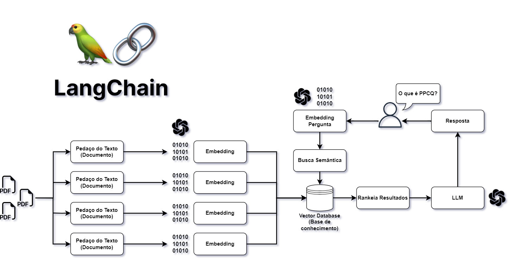
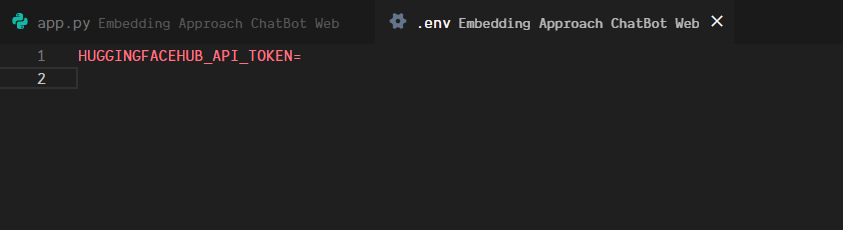
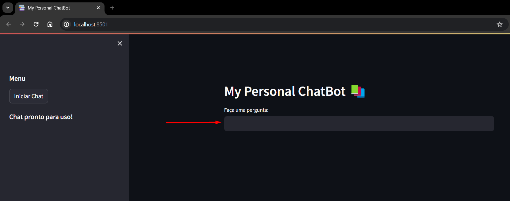
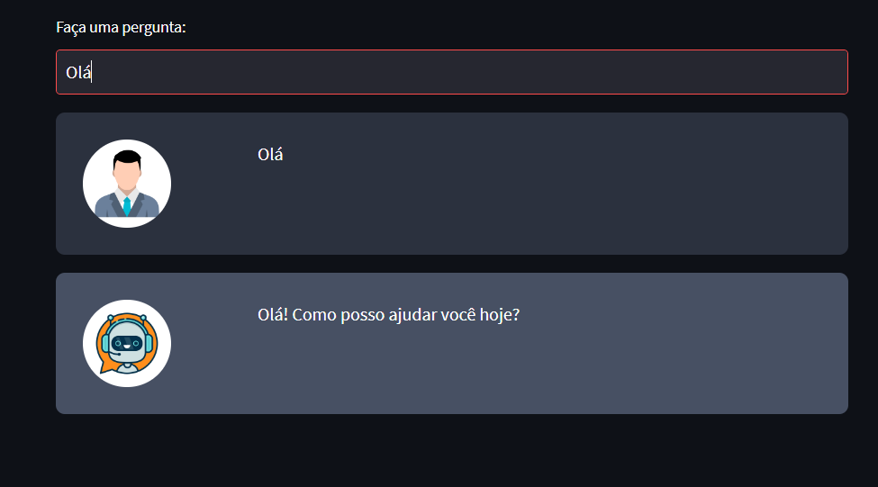

# Documentação do Sistema

1. [Descrição do Software](#descricao)
2. [Dependências do Software](#dependencias)
3. [Instalação e Execução do Software](#instalacao)
4. [Como Usar o Software](#comousar)

## Descrição do Software 📚 

- **Qual é o propósito do software?**

  > O software é um ChatBot que busca utilizar o modelo google/flan-t5-xxl e a abordagem 'Embedding' que transforma em vetores arquivos de texto em PDFs contendo informações relevantes, salva em um vector database para fazer uma busca semântica nessa base dados para alimentar o ChatBot e obter respostas mais precisas para o usuário.

- **Fluxograma do Sistema**
  - 
- **Quais problemas ele resolve?**

  > O principal problema que o software resolve é a necessidade de um ChatBot que pareça o máximo possível com um assistente real capaz de responder perguntas relacionadas aos arquivos analisados.

- **Quem são os usuários-alvo?**
  > Usuários que desejam buscar dados em vários arquivos de textos simultaneamente.

## Dependências do Software 🤖

- **Quais são as dependências do projeto?**
  - Python 3.10 ou superior
  - langchain 0.0.209
  - PyPDF2 3.0.1
  - python-dotenv 1.0.0
  - streamlit 1.18.1 ou superior
  - openai 0.27.6
  - faiss-cpu 1.7.4
  - altair 5 ou superior
  - tiktoken 0.4.0
  - uuid 1.30 ou superior
  - huggingface-hub==0.22.0
  - InstructorEmbedding==1.0.1
  - sentence-transformers==2.2.2

## Instalação e Execução do Software ⚙️

- **Como o software é instalado?**

  > Para instalar o software você deve instalar as dependências do sistema que estão no arquivo requirements.txt na raiz do projeto, para isso use o seguinte comando no terminal:

  - pip install -r requirements.txt

- **Configurando a chave da Huggingface HUB**
  > Após gerar seu Token em https://huggingface.co/settings/tokens, abra o arquivo .env que se encontra na raiz do projeto, nesse arquivo, coloque sua chave na variável HUGGINGFACEHUB_API_TOKEN
  - 
- **Como o Software é executado?**
  > Para executar o software basta executar o seguinte comando no terminal:
  - streamlit run app.py

## Como Usar o Software ✅

- **Mandar uma mensagem para o bot.**

  > Para usar o sistema e começar usar o Chatbot é bem simples, após executar o comando para iniciar a aplicação, a aplicação irá carregar os PDFs da pasta 'books' e irá abrir no seu navegador.

  - **Iniciar Chat**
    

  - **Chat Liberado**
    

  - **Resposta do Chatbot**
    
